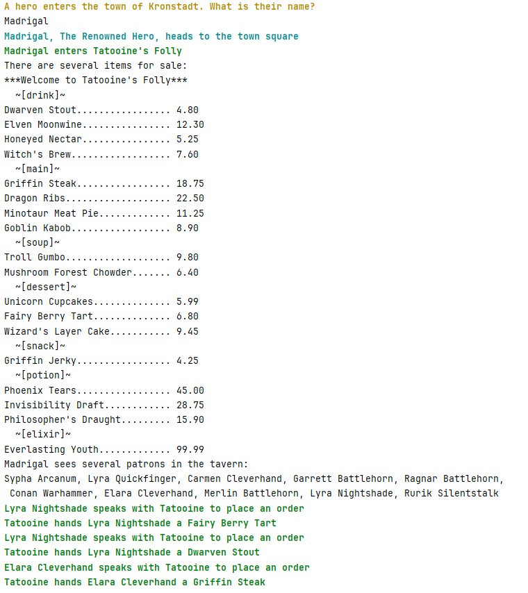

# NyetHack - учебный проект по Kotlin


Учебный проект, создаваемый в процессе изучения книги **"Kotlin. Программирование для профессионалов"** (издательство "Питер").

## О проекте

Этот проект - практическое выполнение примеров и упражнений из книги. NyetHack - текстовая RPG игра.




## Как запустить

```bash
# Клонировать репозиторий
git clone https://github.com/staymkk/NyetHack.git

# Запустить через Gradle
./gradlew run

# Или через IDE (IntelliJ IDEA)
```

## Источник

Книга: "Kotlin. Программирование для профессионалов"

Авторы: Джош Скин, Дэвид Гринхол, Эндрю Бэйли

Издательство: Питер

Все концепции и архитектура следуют материалам книги.

## Лицензия

Учебный проект. Код книги принадлежит авторам и издательству.
